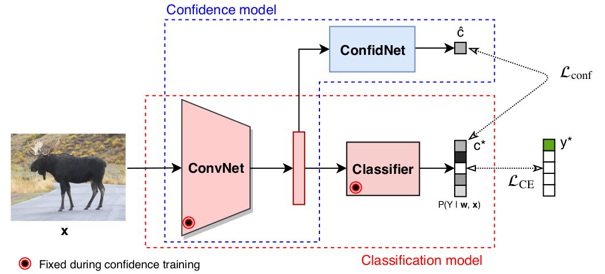

# Addressing Failure Prediction by Learning Model Confidence
 [Charles Corbière](https://chcorbi.github.io/),  [Nicolas Thome](http://cedric.cnam.fr/~thomen/), [Avner Bar-Hen](https://ab-h.github.io/), [Matthieu Cord](http://webia.lip6.fr/~cord/), [Patrick Pérez](https://ptrckprz.github.io/) \
*Neural Information Processing Systems (NeurIPS), 2019*



If you find this code useful for your research, please cite our [paper](https://papers.nips.cc/paper/8556-addressing-failure-prediction-by-learning-model-confidence):

```
@incollection{NIPS2019_8556,
    title = {Addressing Failure Prediction by Learning Model Confidence},
    author = {Corbi\`{e}re, Charles and THOME, Nicolas and Bar-Hen, Avner and Cord, Matthieu and P\'{e}rez, Patrick},
    booktitle = {Advances in Neural Information Processing Systems 32},
    editor = {H. Wallach and H. Larochelle and A. Beygelzimer and F. d\textquotesingle Alch\'{e}-Buc and E. Fox and R. Garnett},
    pages = {2898--2909},
    year = {2019},
    publisher = {Curran Associates, Inc.},
    url = {http://papers.nips.cc/paper/8556-addressing-failure-prediction-by-learning-model-confidence.pdf}
}
```

## Abstract
Assessing reliably the confidence of a deep neural net and predicting its failures is of primary importance for the practical deployment of these models. In this paper, we propose a new target criterion for model confidence, corresponding to the *True Class Probability* (TCP).We show how using the TCP is more suited than relying on the classic *Maximum Class Probability* (MCP). We provide in addition theoretical guarantees for TCP in the context of failure prediction. Since the true class is by essence unknown at test time, we propose to learn TCP criterion on the training set, introducing a specific learning scheme adapted to this context. Extensive experiments are conducted for validating the relevance of the proposed approach. We study various network architectures, small and large scale datasets for image classification and semantic segmentation. We show that our approach consistently outperforms several strong methods, from MCP to Bayesian uncertainty, as well as
recent approaches specifically designed for failure prediction.

## Installation
1. Clone the repo:
```bash
$ git clone https://github.com/valeoai/ConfidNet
```

2. Install this repository and the dependencies using pip:
```bash
$ pip install -e ConfidNet
```

With this, you can edit the ConfidNet code on the fly and import function 
and classes of ConfidNet in other project as well.

3. Optional. To uninstall this package, run:
```bash
$ pip uninstall ConfidNet
```

You can take a look at the [Dockerfile](./Dockerfile) if you are uncertain about steps to install this project.

#### Datasets

MNIST, SVHN, CIFAR-10 and CIFAR-100 datasets are managed by Pytorch dataloader. First time you run a script, the dataloader will download the dataset in ```confidnet/data/DATASETNAME-data```.

CamVid dataset need to be download beforehand (available [here](http://mi.eng.cam.ac.uk/research/projects/VideoRec/CamSeq01/)) and the structure must follow:
```bash
<data_dir>/train/                       % Train images folder
<data_dir>/trainannot/                  % Train labels folder
<data_dir>/val/                         % Validation images folder
<data_dir>/valannot/                    % Validation labels folder
<data_dir>/test/                        % Test images folder
<data_dir>/testannot/                   % Test labels folder
<data_dir>/train.txt                    % List training samples
<data_dir>/val.txt                      % List validation samples
<data_dir>/test.txt                     % List test samples
...
```

## Running the code

### Training
First, to train a baseline model, create a `config.yaml` file adapted to your dataset. You can find examples in `confidnet/confs/`. Don't forget to set the ``output_folder`` entry to a path of your own. (N.B: if the subfolder doesn't exist yet, the script will create one). Then, simply execute the following command: 
```bash
$ cd ConfidNet/confidnet
$ python3 train.py -c confs/your_config_file.yaml 
```
It will create an output folder located as indicated in your `config.yaml`. This folder includes model weights, train/val split used, a copy of your config file and tensorboard logs.

By default, if the output folder is already existing, training will load last weights epoch and will continue. If you want to force restart training, simply add `-f` as argument
```bash
$ cd ConfidNet/confidnet
$ python3 train.py -c confs/your_config_file.yaml -f
```
When training ConfidNet, don't forget to add the folder path of your baseline model in your `config.yaml`: 
```yaml
...
model:
    name: vgg16_selfconfid_classic
    resume: /path/to/weights_folder/model_epoch_040.ckpt
    uncertainty:
```
Same remark if you want to fine-tune ConfidNet, fill the `uncertainty` entry. 
### Testing
To test your model, use the following command:
```bash
$ cd ConfidNet/confidnet
$ python3 test.py -c path/to/your/experiment/folder/your_config_file.yaml -e NUM_EPOCHS -m METHOD
```
* `-c`: indicate here the config yaml copy saved in the output folder
* `-e`: choose model weights to evaluate by their epoch 
* `-m`: choose the method to compute uncertainty. Available methods are `normal` (MCP), `mc_dropout`, `trust_score`, `confidnet`.

Results will be printed at the end of the script.


#### Pre-trained models
Model weights for MNIST and CIFAR-10 datasets used in the paper are available along with this [release](https://github.com/valeoai/ConfidNet/releases/tag/v0.1.0). Each zip file contains weights for pre-trained baseline model and weights for ConfidNet. If you want to use baseline weights:
* unzip files respecting folder structure 
* either for baseline or confidnet, each folder contains at least weights + config file
* fill your config file with the weights folder path
* train your model as indicated earlier


## Acknowledgements
* We thank [Thibaut Durand](http://www.sfu.ca/~tdurand/) for providing C++ implementation of ranking loss extracted from [MANTRA: Minimum Maximum Latent Structural SVM for Image Classification and Ranking](http://www.sfu.ca/~tdurand/projects/mantra/) ([](https://github.com/durandtibo/mantra-python/blob/master/LICENSE))
* Code for Trust Score is borrowed from https://github.com/google/TrustScore ([](https://github.com/google/TrustScore/blob/master/LICENSE))
* [@gyglim](https://gist.github.com/gyglim/1f8dfb1b5c82627ae3efcfbbadb9f514) for the implementation of Tensorboard in Pytorch ([](https://gist.github.com/gyglim/1f8dfb1b5c82627ae3efcfbbadb9f514)).
* [@meetshah1995](https://github.com/meetshah1995/pytorch-semseg) for the implementation of segmentation augmentation in Pytorch ([](https://github.com/meetshah1995/pytorch-semseg/blob/master/LICENSE))
* Special thanks for [@gabrieldemarmiesse](https://github.com/gabrieldemarmiesse) for his work in enhancing, cleaning and formatting this repository for release.

